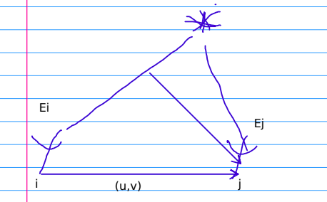
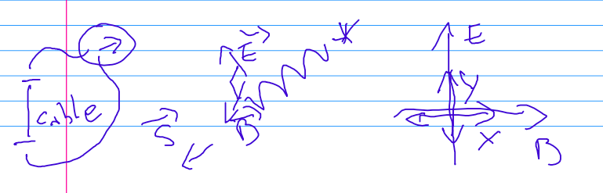
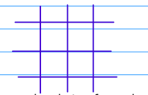
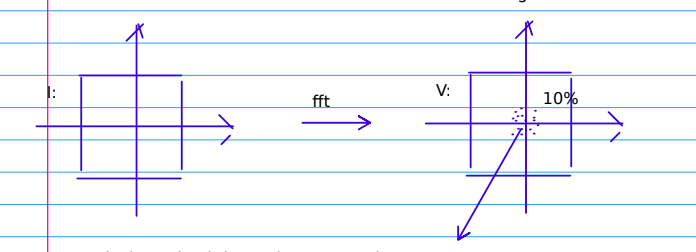
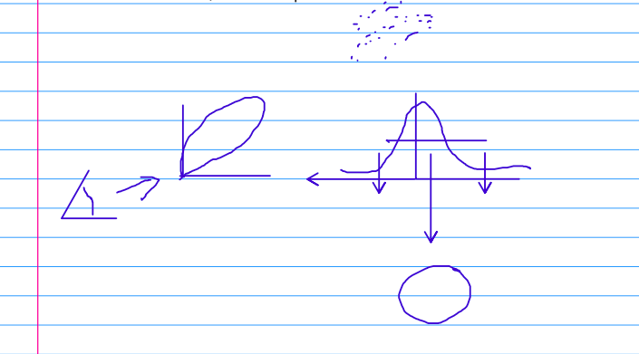
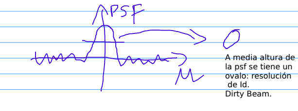

# Clases

## Sintesis de Imagen

  

Se refiere a los datos medidos por un conjunto de antenas. Estos datos son:

* $(V_{ij})$ Promedio del producto del [Campo Electrico](./Electric Field.md) entre dos antenas (las antenas $i$ , $j$ siendo sus campos $E_{i}$ y $E_{j}$).

   $V_{ij} = <E_{i}*E_{j}>$

> Es decir lo que se mide en la antena $i$ multiplicado por lo que se mide en la antena $j$. El numero resultante se le llama [Visibilidad](./Visibilidad.md) y es un numero complejo con unidad de medida de $jansky$, una unidad de energia.   Cuando los datos se reciben nunca se aprecian los campos electricos individuales, si no el resultado final de $(V_{ij})$.

* $(u,v)$ $metros$: Es un vector que determina la distancia entre dos pares de antena 
Se considera como si el objeto observado estuviese en el punto mas alto del cielo. Cuando esta inclinado se considera la proyección. 
* BUSCAR EXPLICACión a lo anterior.

* $(V_{ij})$ $Jy(Jansky)$: Es un par de numeros, es un complejo. Es una unidad de energia. 

* $Frecuencia$ $Hertz$ : Los detectores se construyeron para medir un amplio rango de frecuencias al mismo tiempo. 
 
* $stokes$: Valor discreto que indica la polarización. $(X,Y,R,L,...)$. En alma solo se utilizan 2 tipos $X$ e $Y$.

 
* EXPLICAR IMAGEN

* $W_{ij}$ = $1/{error}^2$ de la medición que se tomo. Es una proporción. 
* BUSCAR! ..

## Teorema de van Cittert-Zernike 
* $V(u,v) = \int I(x,y)e^{2\pi i(u,v)\cdot(x,y) }dx dy$

La visibilidad es la transformada de Fourier de la imagen del cielo.

Se podria pensar que basta aplicar anti transformada para obtener la imagen. Sin embargo esto no funciona asi, debido a que tenemos puntos discretos en el plano u,v pero no localizados en una malla. 

Toda la teoria numerica de transformadas de Fourier esta basada en que los puntos uv se encuentran en puntos regulares(teoria de Nyquist).

Uno podria omitir esto y aplicar lo siguiente: 
* ¿OMITIMOS ESTO??..
$I^{D}(x,y) = \sum_{k} V_{k}e^{-2\pi i(ux+uy)}$

A esto le llamamos imagen sucia. 

## Problema de sintesis de Fourier usando la imagen sucia 

* Una imagen es una matriz (I) de 'double', eso es lo que se mide en un telescopio optico. Si queremos analizar espectralmente la imagen (obtener la transformada de fourier) aplicamos V=fft(I) (en python), se obtiene otra matriz de las mismas dimensiones pero de complejos. (utilizamos iif para la transformada inversa en pyton)

* Si se tuviese la transformada de Fourier pero solo de algunos elementos de dicha V se conocen. Estariamos en el caso de la radio Interferometria. pero ¿Cuantos elementos usualmente se conocen en dicho arreglo?.

* La resolución maxima  = [longitud de onda](./Wavelength.md)$/MaximaSeparación$.

* EXplicar maxima separación..

* Estudiamos la imagen obtenida usando iift(V), y rellenado con 0 en la matriz en los casos desconocidos.

$V^{D}(u) =  \sum_{k} V(u) \delta (u-u_k) = V(u) \sum_{k}\delta (u-u_k)$

$\delta$  Tiene solo valor en 0, en el resto es nula. Se llama delta de dirac, tiene la propiedad de tener integral 1 y 

$\int \delta(u-u_0)f(u) = f(u_0)$

dado lo anterior estudiemos la transformada de fourier de $V^D$ 

* $F(V^D) = F(VS) = F(V)*F(S) = I *F(S)$
* $F(V^D) =  IFFT(V)$ La transformada de V completada con 0 cuando no hay valor.

* $F(S)$ = $\int e^{-2 \pi i(ux+uy)} \sum_{k} \delta (u-u_k) = \sum_{k} cos(2\pi (u_k x +u_k y))$ 
A F(S) se llama Point Spread Function o FSP y sera una imagen.

$I^D =I*F(S)$

Debemos encontrar I. A este problema se le denomina problema de deconvolución. Todo esos problemas son problemas mal puestos, eso significa que tienen infinitas soluciones, debido a que la transformación anterior  es no invertible.

 

a media altura de la psf se obtiene un ovalo, resolución $I^D$ llamado Dirty Beam
 

## Algoritmo Clean

 En 1964 se le ocurre a HogBom el algoritmo Clean. El objetivo es obtener I de la ecuación de convolución. Para esto se utiliza un algoritmo iterativo del tipo Greddy (goloso). A partir de I = 0 e ir agregando pixel a pixel  y convolucionar para obtener $I^{D}$. La idea es que la imagen sucia que se tiene se vaya aproximando a la imagen sucia real. 

 * ¿Como se agregan los pixeles? 
 Se escoge el pixel que disminuya el error de $|I^D - I^D actual |$

 arreglar formato..
 agregar nuevas paginas. (altiro)
 descargar casa
 investigar algoritmo clean.
 generar dudas

