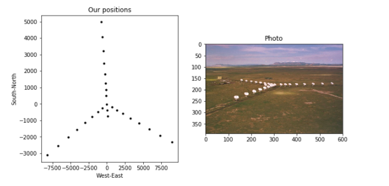
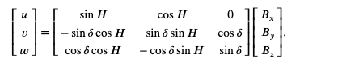
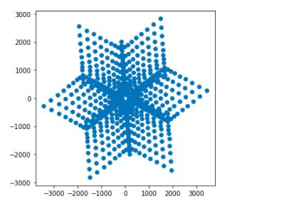

# Code Simulate Interferometer

Librerias a utilizar
```python
import numpy as np
import pandas as pd
import pylab as pl
import cv2
```
Definiendo la constante de tiempo
```python
 const_c = 3e8
```
Vamos a simular algunos datos para el telescopio [VLA](./Very Large Array Telescope.md), en su configuración más compacta. El diámetro de un plato VLA es de 25 metros, vamos a simular una observación monocromática a una frecuencia de 5 GHz
```python
D = 25  # Diametro del plato [Metros]
frequency = 5e9  # frecuencia de observación[Hz]
wavelength = const_c/frequency #longitud de onda
```
[Longitud de onda](./Wavelength.md) ($\lambda$)

Podemos calcular el patrón de recepción de un plato individual, conocido como [Primary Beam](./Primary Beam.md) utilizando

$\Delta$ $\theta_{\rm pb}$ $=$ $\frac{\lambda}{D}$ Angulo en radianes

Nota: a veces se verá un factor previo delante de esta ecuación (por ejemplo, $1.22$  $\lambda$ $/D$ $ o $1.02$ o $1.15$ ...). Este prefactor depende de la iluminación del plato por parte del receptor, que se puede cambiar (por ejemplo) reduciendo los bordes de un plato parabólico.

```python
FoV = wavelength/D  # Campo de visión[rads]  BUSCAR SOBRE ESTO!
print('Field of View =', round(FoV*180./np.pi, 2) ,'degrees')
```

Ahora deberíamos definir la distribución de nuestras antenas en el suelo.Vamos a pretender que estamos usando el telescopio [VLA](./Very Large Array Telescope.md) (configuración más compacta). Las posiciones estan como archivos CSV. El VLA tiene tres "brazos": Norte, Suroeste y Sureste.

```python
vla_north = pd.read_csv('data/VLA_North.csv')
vla_swest = pd.read_csv('data/VLA_SWest.csv')
vla_seast = pd.read_csv('data/VLA_SEast.csv')
```

Las posiciones de las antenas de radio se proporcionan en unidades de nanosegundos. Podemos convertirlos en unidades de número de [Longitudes de onda](./Wavelength.md):

$b\,{\rm [\lambda]} = 10^{-9}\frac{\rm c}{\lambda}\times b\,{\rm [ns]}$
```python
W = 1e-9/wavelength*const_c*np.array(vla_swest) # [number of wavelengths]
E = 1e-9/wavelength*const_c*np.array(vla_seast) 
N = 1e-9/wavelength*const_c*np.array(vla_north)
```
Ahora graficamos
```python

pl.figure(figsize=(10, 5))
pl.subplot(121)
pl.title('Our positions') 
pl.xlabel('West-East') 
pl.ylabel('South-North')
pl.plot(W[:,1], -W[:,0], 'k.', E[:,1], -E[:,0], 'k.', N[:,1], -N[:,0], 'k.')
pl.subplot(122) 
vla = cv2.imread('./images/VLA-D_lo.jpg')
pl.title('Photo') 
pl.imshow(cv2.cvtColor(vla, cv2.COLOR_BGR2RGB))
```


```python
vla_d = np.vstack((vla_swest,vla_seast,vla_north)) # make a single array of all antenna positions
#print(vla_d)
XYZ_baselines = []                                                                  
for i in range(len(vla_d)):                                                         
    for j in range(i+1,len(vla_d)):
        XYZ_baselines.append(np.subtract(vla_d[i], vla_d[j])) # (u,v)
        XYZ_baselines.append(np.subtract(vla_d[j], vla_d[i])) # (-u,-v)     
#print(XYZ_baselines)
        
XYZ_baselines = np.array(XYZ_baselines)
print("No. of baselines in (u,v) plane:", int(len(XYZ_baselines)/2)) 
```

El muestreo en el espacio de Fourier $(u,v,w)$ se calcula transformando cada línea base XYZ, $\textbf{B}$, en el plano perpendicular a la dirección de la fuente (es decir, la línea base proyectada ) usando:



Aquí hemos definido la dirección de origen ($\textbf {s}$) en términos de su posición en el ángulo horario ($H$) y la declinación ($\delta$). Normalmente, las posiciones de fuente astronómica se definen en el [Sistema de coordenadas ecuatoriales](https://en.wikipedia.org/wiki/Equatorial_coordinate_system) en términos de Ascensión recta y declinación; 
El ángulo horario es la diferencia angular entre la ascensión recta ($RA$) de la fuente y el tiempo sideral local (LST) en el telescopio, que depende de la longitud del telescopio, expresada en horas:

$HA = LST - RA$

mirar: [Fig 4.2](https://link.springer.com/chapter/10.1007/978-3-319-44431-4_4) of TMS. 

A medida que la Tierra gira, 15 grados del cielo serán barridos en una hora. Asumiremos que estamos haciendo una observación de una hora de duración, $-0.5 <H <0.5$, lo que significa que la dirección de puntería astronómica se mueve a través de la mediana celeste local. Haremos una muestra de datos cada 6 minutos (0.1 horas).

Voy a elegir una declinación para la dirección de origen de $\delta = 45$ grados.

** Nota: ** Es posible que desee investigar cómo cambia su patrón de muestreo *uv* si modifica la declinación de la fuente.

```python
HA = np.arange(-0.5*15.*(np.pi/180.), 0.5*15.*(np.pi/180.), 0.1*(np.pi/180.))  # [radians]
dec = np.pi/4.    
```
Podemos calcular la matriz de rotación para cada paso en ángulo de hora:
```python
def calc_R(H,dec):
    """
    function to calculate rotation matrix
    """
    R = [[np.sin(H), np.cos(H), 0],\
        [-np.sin(dec)*np.cos(H), np.sin(dec)*np.sin(H), np.cos(dec)],\
        [np.cos(dec)*np.cos(H), -np.cos(dec)*np.sin(H), np.sin(dec)]]
    
    return np.array(R)
```

Primero veamos cómo se ve el muestreo *uv* para un solo paso de tiempo. Llamamos pasos de tiempo individuales *instantáneas*.
```python
UV_snapshot=[]
for j in range(len(XYZ_baselines)):
    R = calc_R(0.,dec) # rotation matrix for HA = 0.0
    UV_snapshot.append(np.dot(R, XYZ_baselines[j]))
UV_snapshot = np.array(UV_snapshot)
```
```python
pl.figure(figsize=(5, 5))
pl.scatter(UV_snapshot[:,0],UV_snapshot[:,1])
```




