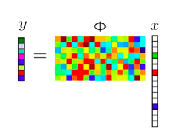

# Compressive Sensing

# referenciar 
Los enfoques tradicionales para muestrear señales o imágenes se basan en teorema de Nyquist: la frecuencia de muestreo debe ser al menos el doble del máximo frecuencia presente en la señal. Utilizando este teorema las señales muestreadas o las imágenes mantienen completamente la información de las señales originales para que podamos recuperarlos exactamente más tarde. De hecho, este principio subyace en casi todas las señales. protocolos de adquisición utilizados en electrónica de audio y visual de consumo, médica dispositivos de imagen, receptores de radio, etc.

En muchos emergentes e importantes áreas, la tasa resultante de Nyquist sigue siendo tan alta que terminamos con demasiados muestras, a veces, puede ser demasiado costoso o incluso físicamente imposible de construir dispositivos que son capaces de adquirir muestras a la velocidad necesaria. Por lo tanto, en algunas áreas de aplicación, como imágenes médicas, vigilancia remota, espectroscopia, [Radio Interferómetro](./Radio Interferometry.md). Los sistemas de detección tradicionales basados ​​en el teorema de Nyquist ya no puede satisfacer la necesidad.

Para tratar con datos de tan dimensionales, generalmente dependemos de la compresión, que tiene como objetivo encontrar una representación adecuada de una señal que tiene menor dimensión y contiene tanta información original como sea posible.

Por ejemplo, utilizando el operador de medición para detectar la señal original (x), obtenemos el vector medido (y). El vector medido no sólo contiene todos los información necesaria para la reconstrucción de la señal original, también es mucha menor.

La teoría de la detección de compresión afirma que uno puede recuperar cierta señales e imágenes de muchas menos muestras o medidas que las tradicionales métodos de uso. El concepto clave de la detección comprimida es que podemos reducir el costo de la medición de ciertas señales si las señales tienen cierta características (es decir, las señales son escasas en una base conocida). 

 [Compressed Sensing Theory ](./Compressed Sensing Theory .md) consta principalmente de tres partes: Representación, Operadores de medición y algoritmos de reconstrucción de señales.

 CITAR ! Exploration of the performance of SDMM algorithm, Sheng Wang, August 19, 2016)

