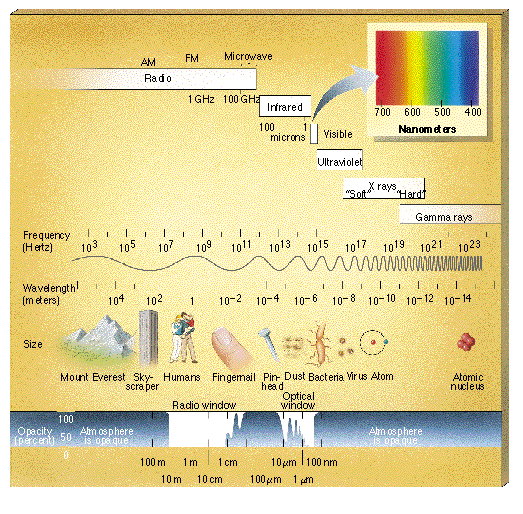

# Electromagnetic Spectrum

Los nombres de los diferentes tipos de emisión, en energía o frecuencia:

* rayos gamma (> ~ 1 MeV)
* hard X-rays (10-1000 keV)
* soft X-rays (1-10 A)
* EUV (~ 100 A)
* UV (~ 1000 A)
* visible (4000-7000 A - 400-700 nm)
* IR cercano (~ 1 micrón)
* IR (10 micras)
* THz (~ 100 micras - 3000 GHz)
* submilímetro (300 GHz - 700 GHz)
* milímetro (30 GHz - 300 GHz)
* microondas (3 GHz - 30 GHz)
* decímetro (300 MHz - 3 GHz) (banda de TV / UHF "cable")
* onda de metro (30 MHz - 300 MHz) (banda de TV / FM / HF)
* decametro (3 MHz - 30 MHz) (onda corta
* Banda de AM (0.5 MHz - 1.7 MHz)

Tenga en cuenta que las unidades cambian a medida que avanzamos de arriba a abajo: use unidades de energía cerca en la parte superior, luego cambia a unidades de longitud de onda, luego cambie a unidades de frecuencia. Esto es puramente una cuestión de conveniencia y convención. Podríamos seguir con la energía, o la longitud de onda, o la frecuencia, pero el rango de 6 o 7 décadas hace que sea inconveniente seguir con una sola medida. Las relaciones entre energía, frecuencia y longitud de onda son, por supuesto:

$E = hn= hc/l$

las técnicas de interferometría y síntesis de imágenes utilizan el rango de submilimétrico a decametro, aunque existen dificultades prácticas en ambos extremos, y actualmente es más común usar interferometría en el milímetro para rango de metro de onda. Hay esfuerzos continuos para extender la interferometría a frecuencias más altas (submilímetro - ALMA) y frecuencias más bajas (space arrays)

[Introducción a la radioastronomía, E. Gary](https://web.njit.edu/~gary/728/Lecture1.html)
