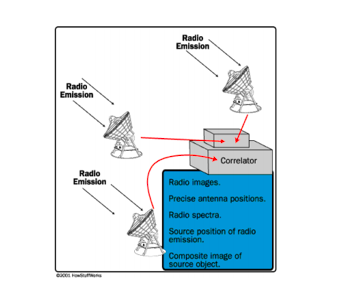

# Radio Interferometry

Los [Radio Telescopio](./Radio Telescopio.md) se pueden usar individualmente o se pueden unir. El conjunto de Radiotelescopios, es también conocido como Interferómetro astronómico.

Algunos científicos encontraron que el efecto de más de un radiotelescopio actuando juntos es el mismo que la de un solo telescopio ya que la resolución de un interferómetro no depende del diámetro de los radiotelescopios individuales, sino en la separación máxima entre ellos. Alejarlos más aumenta la resolución angular, lo que significa un aumento de la capacidad del telescopio para resolver objetos más pequeños en el cielo. 

En un [interferómetro](./Interferometry.md), las señales de todos los telescopios se juntan y procesado por un correlacionador, que combina las señales para que efectivamente simulé un solo telescopio mucho más grande. 

Recientemente hay un proyecto de radiotelescopio llamado [Square Kilometre Array Telescope](./Square Kilometre Array Telescope.md) que involucra a muchos países. Tiene como objetivo construir varias matrices de telescopios para lograr una amplia área de recolección de aproximadamente un kilómetro cuadrado. Cuando el SKA esté completado, con suerte superará la resolución de instrumentos ópticos como [Hubble Space Telescope](./Hubble Space Telescope.md) uno de los ópticos más grandes y versátiles telescopio.

Muchos telescopios significan muchos datos y  algoritmos eficientes para la conversión de los datos recopilados de estaciones de telescopios separados.

