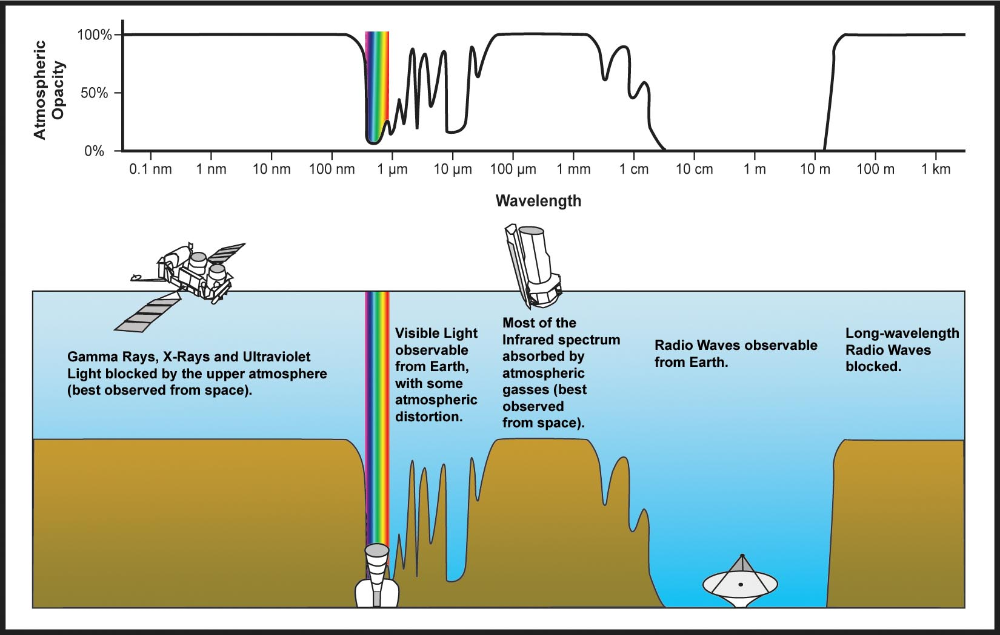

# Radio Wavelengths

Las ondas de radio son un tipo de radiación electromagnética con [longitud de onda](./Wavelength.md) en el [espectro electromagnético](./Electromagnetic Spectrum.md) más largo que la luz infrarroja.

Las ondas de radio se propagan desde frecuencias de 10 THz hasta 10 kHz, cuyas correspondientes longitudes de onda son desde los 100 micrómetros (0.0039 pulgadas) hasta los 100 kilómetros (62 millas). Como todas las ondas electromagnéticas si viajan por el vacío o por el aire, las ondas de radio viajan a la velocidad de la luz.

Las ondas de radio pueden ser creadas de manera natural por fenómenos naturales tales como relámpagos, o por objetos astronómicos. También pueden ser generadas de manera artificial y son utilizadas para comunicaciones radio fija y móvil, radiodifusión, radar y otros sistemas de navegación, satélites de comunicaciones, redes telemáticas y otras muchas aplicaciones.

* [Referencia Wikipedia](https://es.wikipedia.org/wiki/Ondas_de_radio)

¿ Por que Observar en Radio Ondas? 
Hay muchas razones por las cuales es ventajoso observar en longitudes de onda de radio.

* Las ondas de radio llegan al suelo 
* Puede observar objetos o fenómenos que son difíciles o imposibles de detectar en otros rangos de longitud de onda.
* Puede usar la emisión de radio para el diagnóstico físico cuantitativo de los parámetros del objeto

La primera razón es simplemente que es posible observar ondas de radio desde el suelo. Como se muestra en la figura a continuación, se necesitan naves espaciales para observar objetos astronómicos en rayos gamma, rayos X, UV e IR, mientras que las observaciones en tierra son posibles en algunas partes del IR cercano y la radio. 

